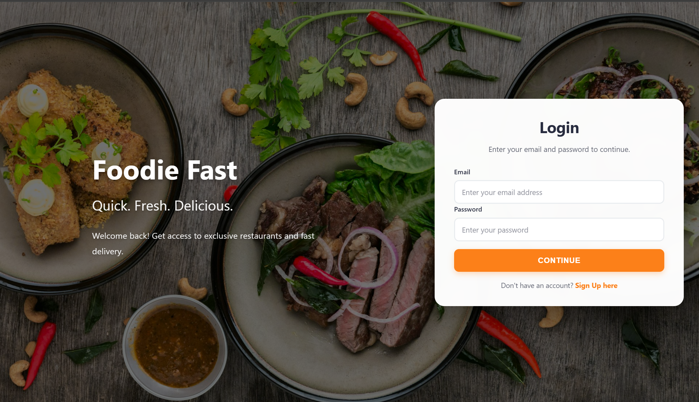
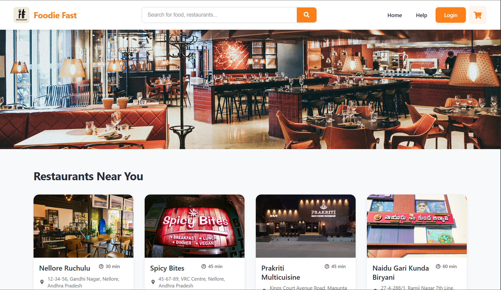
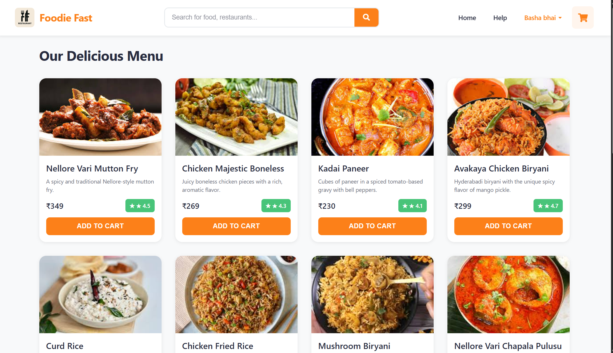
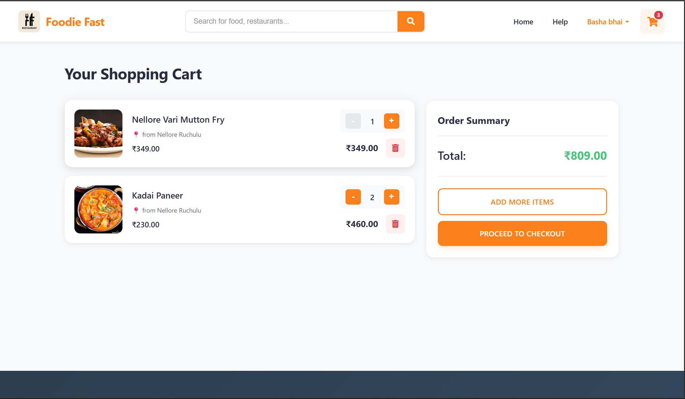
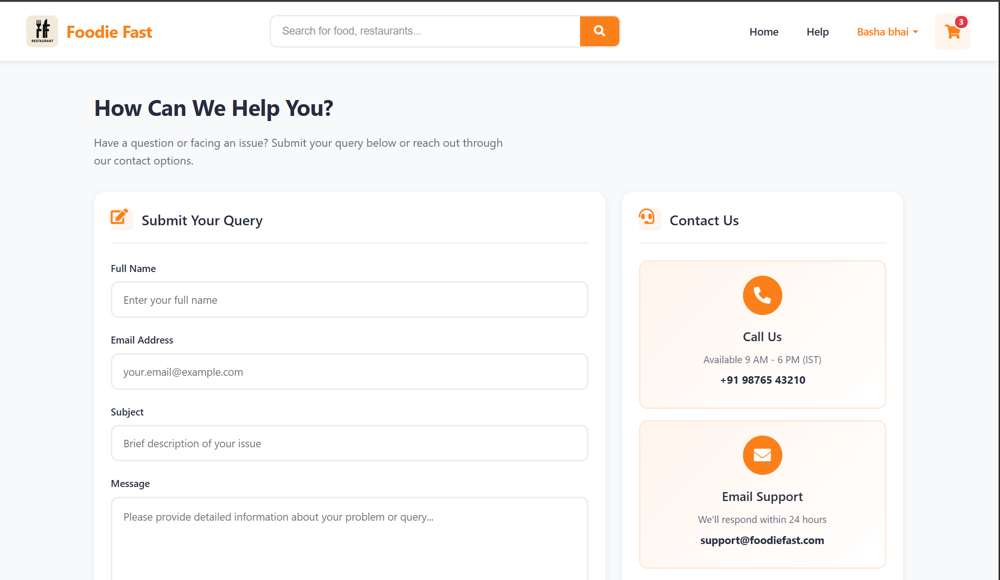
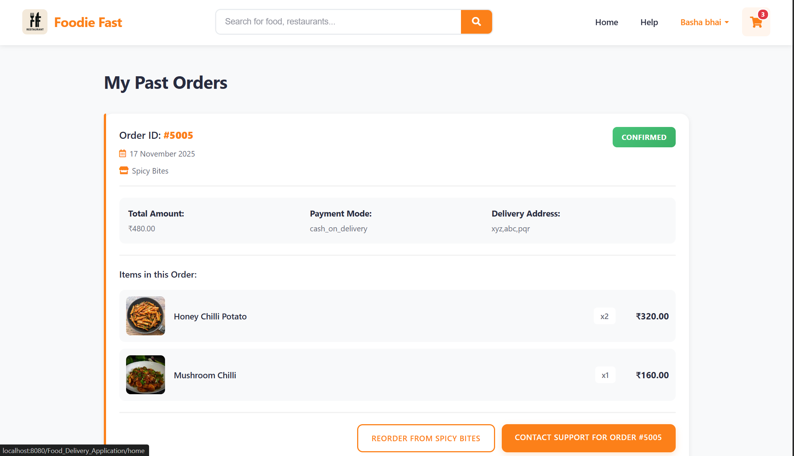

# 🍔 Food Delivery Application

[](https://www.java.com/)
[](https://www.oracle.com/java/technologies/jspt.html)
[](https://jakarta.ee/specifications/servlet/)
[](https://www.mysql.com/)

A comprehensive food delivery web application built with Java, JSP, and Servlets. This application provides a complete online food ordering system with restaurant management, menu browsing, cart functionality, and order processing capabilities.

## 📋 Table of Contents
- [About](#about)
- [Features](#features)
- [Technologies Used](#technologies-used)
- [System Requirements](#system-requirements)
- [Installation](#installation)
- [Database Setup](#database-setup)
- [Project Structure](#project-structure)
- [API Endpoints](#api-endpoints)
- [Contributing](#contributing)


## 🎯 About

Food Delivery Application is a full-stack web application that simulates a real-world food ordering and delivery platform. Built using Java EE technologies with a clean layered architecture, this project demonstrates professional web development practices including DAO pattern implementation, servlet-based MVC architecture, session management, and JDBC database operations.

## ✨ Features

### Customer Features
- 🍕 **Restaurant Browsing** - View multiple restaurants and their menus
- 🔍 **Menu Exploration** - Browse categorized food items with descriptions and prices
- 🛒 **Shopping Cart** - Add, update, and remove items with real-time total calculation
- 💳 **Checkout Process** - Complete order placement with delivery details
- 📦 **Order Tracking** - View order history and current order status
- 👤 **User Profile** - Manage personal information and preferences
- 🔐 **Secure Authentication** - Registration and login with session management

### Admin/Restaurant Features
- 📊 **Dashboard** - Overview of orders and restaurant performance
- 🍽️ **Menu Management** - Add, edit, and delete menu items
- 📋 **Order Management** - View and process customer orders
- 🏪 **Restaurant Management** - Manage restaurant information and details

### Technical Features
- **DAO Pattern** - Separate data access layer for clean code organization
- **Implementation Classes** - Concrete implementations for all DAO interfaces
- **Session Management** - Secure user session handling
- **JDBC Integration** - Efficient database operations
- **Responsive Design** - Mobile-friendly interface with custom CSS

## 🛠️ Technologies Used

### Backend
- **Java** - Core programming language (JDK 8+)
- **Servlets** - Request handling and business logic
- **JSP (JavaServer Pages)** - Dynamic view rendering
- **JDBC** - Database connectivity and operations

### Frontend
- **HTML5** - Structure and content
- **CSS3** - Custom styling (cards.css, cart.css, navbar.css, etc.)
- **JavaScript** - Client-side interactions
- **Bootstrap** (optional) - Responsive components

### Database
- **MySQL** - Relational database for data persistence

### Server
- **Apache Tomcat 9.0+** - Web application server

### Development Tools
- **Eclipse IDE** / **IntelliJ IDEA** - Java development
- **MySQL Workbench** - Database management
- **Git** - Version control

## 💻 System Requirements

### Prerequisites
- **JDK 8 or higher** - Java Development Kit
- **Apache Tomcat 9.0+** - Application server
- **MySQL 5.7+** - Database server
- **Eclipse IDE for Java EE** or **IntelliJ IDEA Ultimate**
- **MySQL Connector/J** - JDBC driver
- **Web Browser** - Chrome, Firefox, Safari, or Edge

### Hardware Requirements
- **RAM:** 4GB minimum, 8GB recommended
- **Storage:** 1GB free disk space
- **Processor:** Dual-core or better

## 📥 Installation

### Step 1: Clone the Repository
```bash
git clone https://github.com/Vishnu0701g/Foodie-Fast--Food-App--JAVA-Project.git
cd Foodie-Fast--Food-App--JAVA-Project
```

### Step 2: Import into Eclipse IDE

1. **Open Eclipse IDE**
2. **Import Project:**
   - File → Import → Existing Projects into Workspace
   - Select root directory: Browse to cloned project folder
   - Select the project: `Food_Delivery_Application`
   - Click **Finish**

3. **Configure Build Path:**
   - Right-click project → Properties → Java Build Path
   - Libraries tab → Add External JARs
   - Add MySQL Connector JAR (mysql-connector-java-x.x.x.jar)
   - Apply and Close

### Step 3: Configure Apache Tomcat

1. **Add Tomcat Server:**
   - Window → Show View → Servers
   - Right-click in Servers view → New → Server
   - Select Apache Tomcat v9.0
   - Browse to Tomcat installation directory
   - Click **Finish**

2. **Add Project to Server:**
   - Right-click on Tomcat server → Add and Remove
   - Select `Food_Delivery_Application` → Add
   - Click **Finish**

## 🗄️ Database Setup

### Step 1: Import Database
Import **[Download/View the SQL Schema File (Dump20250925.sql)](assets/Dump20250925.sql) file in mysql-Workbench


### Step 2: Configure Database Connection

Update the `DBConnection.java` file in `com.app.util` package:

```java
package com.app.util;

import java.sql.Connection;
import java.sql.DriverManager;
import java.sql.SQLException;

public class DBConnection {
    private static final String URL = "jdbc:mysql://localhost:3306/food_delivery";
    private static final String USERNAME = "root";
    private static final String PASSWORD = "your_mysql_password";
    
    static {
        try {
            Class.forName("com.mysql.cj.jdbc.Driver");
        } catch (ClassNotFoundException e) {
            e.printStackTrace();
        }
    }
    
    public static Connection getConnection() throws SQLException {
        return DriverManager.getConnection(URL, USERNAME, PASSWORD);
    }
}
```

## 📁 Project Structure

```
Food_Delivery_Application/
│
├── src/
│   └── main/
│       └── java/
│           ├── com.app.dao/                    # Data Access Object Interfaces
│           │   ├── MenuDAO.java
│           │   ├── OrderDAO.java
│           │   ├── OrderItemDAO.java
│           │   ├── RestaurantDAO.java
│           │   └── UserDAO.java
│           │
│           ├── com.app.daoimplementation/      # DAO Implementation Classes
│           │   ├── MenuDAOImpl.java
│           │   ├── OrderDAOImpl.java
│           │   ├── OrderItemDAOImpl.java
│           │   ├── RestaurantDAOImpl.java
│           │   └── UserDAOImpl.java
│           │
│           ├── com.app.model/                  # Entity/Model Classes
│           │   ├── Cart.java
│           │   ├── CartItem.java
│           │   ├── Menu.java
│           │   ├── Order.java
│           │   ├── OrderItem.java
│           │   ├── Restaurant.java
│           │   └── User.java
│           │
│           ├── com.app.servlets/               # Servlet Controllers
│           │   ├── CartServlet.java
│           │   ├── HomeServlet.java
│           │   ├── LoginServlet.java
│           │   ├── LogoutServlet.java
│           │   ├── MenuServlet.java
│           │   ├── MyOrdersServlet.java
│           │   ├── ProceedToCheckoutServlet.java
│           │   ├── RegisterServlet.java
│           │   └── UpdateProfileServlet.java
│           │
│           └── com.app.util/                   # Utility Classes
│               └── DBConnection.java
│
├── src/
│   └── main/
│       └── webapp/
│           ├── META-INF/
│           │   └── MANIFEST.MF
│           │
│           ├── WEB-INF/
│           │   └── web.xml                     # Deployment Descriptor
│           │
│           ├── images/                         # Image assets
│           │
│           ├── cart.css                        # Cart page styling
│           ├── cart.jsp                        # Shopping cart page
│           ├── cards.css                       # Card components styling
│           ├── checkout.css                    # Checkout page styling
│           ├── checkout.jsp                    # Checkout page
│           ├── footer.jsp                      # Footer component
│           ├── help.css                        # Help page styling
│           ├── help.html                       # Help/FAQ page
│           ├── help.jsp                        # Help page (JSP version)
│           ├── login.jsp                       # Login page
│           ├── menu.jsp                        # Restaurant menu page
│           ├── myOrders.jsp                    # Order history page
│           ├── navbar.css                      # Navigation bar styling
│           ├── navbar.jsp                      # Navigation bar component
│           ├── orderPlaced.jsp                 # Order confirmation page
│           ├── orders.css                      # Orders page styling
│           ├── profile.css                     # Profile page styling
│           ├── profile.jsp                     # User profile page
│           ├── registration.jsp                # Registration page
│           ├── restaurant.jsp                  # Restaurant listing page
│           └── style.css                       # Global styles
│
├── build/                                      # Compiled classes
├── Libraries/                                  # Project libraries
├── Referenced Libraries/                       # External JAR files
│   └── mysql-connector-java-x.x.x.jar
│
└── README.md                                   # This file
```

## 🔌 API Endpoints (Servlets)

### Authentication
- **POST** `/login` - User login (LoginServlet)
- **POST** `/register` - User registration (RegisterServlet)
- **GET** `/logout` - User logout (LogoutServlet)

### Menu & Restaurants
- **GET** `/home` - Display restaurants (HomeServlet)
- **GET** `/menu` - Display restaurant menu (MenuServlet)

### Shopping Cart
- **POST** `/cart` - Add/update/remove cart items (CartServlet)
- **GET** `/cart` - View cart

### Orders
- **POST** `/checkout` - Process checkout (ProceedToCheckoutServlet)
- **GET** `/myOrders` - View order history (MyOrdersServlet)

### User Profile
- **POST** `/updateProfile` - Update user details (UpdateProfileServlet)


## 🔧 Configuration

### web.xml Configuration

```xml
<?xml version="1.0" encoding="UTF-8"?>
<web-app xmlns="http://xmlns.jcp.org/xml/ns/javaee"
         xmlns:xsi="http://www.w3.org/2001/XMLSchema-instance"
         xsi:schemaLocation="http://xmlns.jcp.org/xml/ns/javaee 
         http://xmlns.jcp.org/xml/ns/javaee/web-app_4_0.xsd"
         version="4.0">
    
    <display-name>Food_Delivery_Application</display-name>
    
    <welcome-file-list>
        <welcome-file>home</welcome-file>
        <welcome-file>login.jsp</welcome-file>
    </welcome-file-list>
    
    <!-- Servlet Mappings -->
    <servlet>
        <servlet-name>LoginServlet</servlet-name>
        <servlet-class>com.app.servlets.LoginServlet</servlet-class>
    </servlet>
    <servlet-mapping>
        <servlet-name>LoginServlet</servlet-name>
        <url-pattern>/login</url-pattern>
    </servlet-mapping>
    
    <!-- Session Configuration -->
    <session-config>
        <session-timeout>30</session-timeout>
    </session-config>
</web-app>
```

## 🐛 Troubleshooting

### Common Issues and Solutions

#### 1. Database Connection Error
**Problem:** `SQLException: Access denied for user`
**Solution:**
- Verify MySQL username and password in DBConnection.java
- Ensure MySQL server is running
- Check if database 'food_delivery' exists

#### 2. ClassNotFoundException for MySQL Driver
**Problem:** `java.lang.ClassNotFoundException: com.mysql.cj.jdbc.Driver`
**Solution:**
- Download MySQL Connector/J from MySQL website
- Add JAR to project: Right-click project → Build Path → Add External Archives
- Place JAR in `WEB-INF/lib` folder for deployment

#### 3. Tomcat Port Already in Use
**Problem:** `Port 8080 already in use`
**Solution:**
- Change Tomcat port: Double-click Tomcat server → Ports → Change HTTP/1.1 port
- Or stop process using port 8080

#### 4. 404 Error on Servlets
**Problem:** Servlet not found
**Solution:**
- Check web.xml servlet mappings
- Verify @WebServlet annotation
- Clean and rebuild project: Project → Clean
- Restart Tomcat server

#### 5. Session Timeout Issues
**Problem:** User logged out too quickly
**Solution:**
- Increase session timeout in web.xml
- Check session management in servlets

#### 6. JSP Not Displaying Data
**Problem:** Empty pages or missing data
**Solution:**
- Check servlet request attributes
- Verify JSP EL expressions: `${attributeName}`
- Enable JSP error display in web.xml

## 🤝 Contributing

Contributions are welcome! Please follow these steps:

1. **Fork the Repository**
2. **Create Feature Branch**
   ```bash
   git checkout -b feature/AmazingFeature
   ```
3. **Commit Changes**
   ```bash
   git commit -m 'Add some AmazingFeature'
   ```
4. **Push to Branch**
   ```bash
   git push origin feature/AmazingFeature
   ```
5. **Open Pull Request**

### Coding Standards
- Follow Java naming conventions
- Use meaningful variable and method names
- Comment complex logic
- Write clean, readable code
- Test thoroughly before committing


## 📧 Contact

**Vishnu** - [@Vishnu0701g](https://github.com/Vishnu0701g)

**Project Link:** [https://github.com/Vishnu0701g/Foodie-Fast--Food-App--JAVA-Project](https://github.com/Vishnu0701g/Foodie-Fast--Food-App--JAVA-Project)

## 🙏 Acknowledgments

- Apache Tomcat team for the excellent servlet container
- MySQL for the robust database system
- Java EE / Jakarta EE community for documentation

## 📸 Screenshots

*Add screenshots here to showcase:*
- Login/Registration page


- Restaurant listing

- Menu browsing
  
- Shopping cart
 
- help page
  
- Order history
  


## 🔮 Future Enhancements

- [ ] **Payment Gateway Integration** - Razorpay, PayPal, Stripe
- [ ] **Real-time Order Tracking** - Live GPS tracking
- [ ] **Email Notifications** - Order confirmations and updates
- [ ] **SMS Alerts** - Order status via SMS
- [ ] **Rating & Review System** - Customer feedback for restaurants
- [ ] **Favorites & Wishlists** - Save favorite restaurants and items
- [ ] **Coupon System** - Discount codes and promotions
- [ ] **Advanced Search** - Filter by cuisine, price, rating
- [ ] **RESTful API** - Mobile app integration
- [ ] **Admin Analytics Dashboard** - Sales reports and insights
- [ ] **Multi-language Support** - Internationalization
- [ ] **Dark Mode** - UI theme toggle


